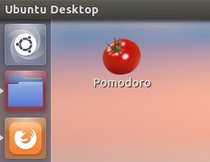
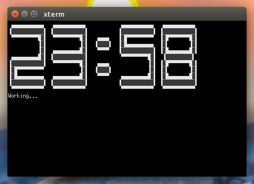
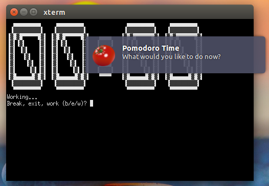

# Pomodoro Time CLI

Una aplicación en línea de comandos para la técnica **Pomodoro**.

### Usando Pomodoro Time CLI

Pomodoro divide el tiempo de _trabajo / estudio / concentración_ en bloques de 25 minutos, con pausas de 5 a 15 minutos. Las pausas breves se intercalan entre cada uno de los ciclos de trabajo, mientras que las más extensas lo hacen una vez a cada 4 ciclos:

> (25' + 5') + (25' + 5') + (25' + 5') + (25' + **15'**) ...

Cada ciclo será señalizado por medio de una señal sonora y una notificación del sistema. El usuario puede optar por continuar trabajando, descansar o finalizar la aplicación.

### Requisitos previos

**Pomodoro Time CLI** fue escrito en **Python3** y sólo ha sido testado en **Ubuntu Linux**. La aplicación se encuentra en un estado muy temprano de desarrollo.

    python 3.x
    [pygame](http://pygame.org)

### Instalando y ejecutando Pomodoro Time CLI

Abra el terminal y ejecute los siguientes comandos:

```bash
    $ git clone git@github.com:aledruetta/pomodoro_time_CLI.git
    $ cd path/to/pomodoro_time_CLI
    $ python3 pomodoro.py
```

## Acceso directo en el escritorio

Cree un archivo Pomodoro.desktop en el escritorio:

```bash
    $ gedit Pomodoro.desktop
```

Agregue al fichero las siguientes lineas y edite los paths:

```bash
    [Desktop Entry]
    Comment=A command line Pomodoro app
    Terminal=true
    Name=Pomodoro
    Exec=python3 path/to/pomodoro.py
    Type=Application
    Icon=path/to/tomato.xpm
```

Permisos de ejecución:

```bash
    $ cd ~/Desktop
    $ chmod +x Pomodoro.desktop
```

### Próximos pasos

    - Implementar un sistema de etiquetas (tags) e informe de tiempo dedicado a cada tarea.

### Screenshots

- Acceso directo:



- Reloj:



- Notificaciones:



